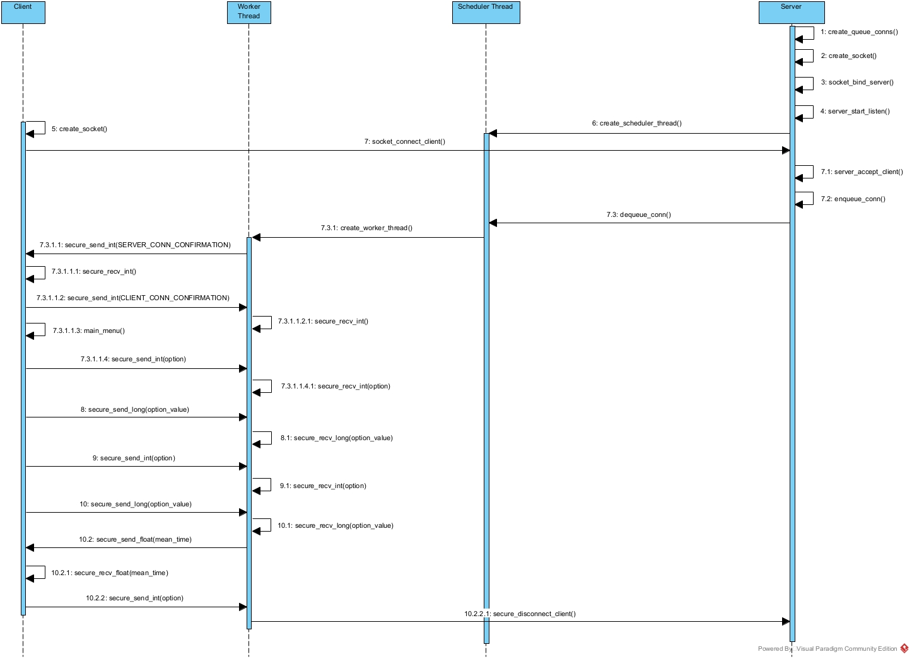

# Fast Search - Operating Systems

- [Fast Search - Operating Systems](#fast-search---operating-systems)
  - [Description](#description)
  - [Project Setup](#project-setup)
    - [Run Server](#run-server)
    - [Run Client](#run-client)
  - [Example Of How The Program Works](#example-of-how-the-program-works)
  - [User Documentation](#user-documentation)
  - [Dev Documentation](#dev-documentation)
    - [Client](#client)
      - [Client Macros](#client-macros)
      - [Client Header Guard](#client-header-guard)
    - [File](#file)
      - [File Dependencies](#file-dependencies)
      - [File Functions](#file-functions)
    - [Logger](#logger)
      - [Logger Dependencies](#logger-dependencies)
      - [Logger Macros](#logger-macros)
      - [Global Variable](#global-variable)
      - [Functions](#functions)
    - [Menu](#menu)
      - [Menu Dependencies](#menu-dependencies)
      - [Menu Macros](#menu-macros)
      - [Menu Functions](#menu-functions)
    - [Pre Process](#pre-process)
      - [Preprocessor Dependencies](#preprocessor-dependencies)
      - [Preprocessor Macros](#preprocessor-macros)
      - [Preprocessor Structure](#preprocessor-structure)
      - [Preprocessor Functions](#preprocessor-functions)
    - [Protocol](#protocol)
      - [Protocol Dependencies](#protocol-dependencies)
      - [Protocol Macros](#protocol-macros)
      - [Protocol Functions](#protocol-functions)
    - [Search](#search)
    - [Server](#server)
    - [Socket](#socket)
    - [Structures](#structures)
    - [Run Pre Process](#run-pre-process)

Author: csandovalc

## Description

The project involves the development of a rapid search system using the C programming language in POSIX operating systems. This system enables users to efficiently search through a text file containing multiple records.

To optimize search speed, the system employs indexed files, which store pertinent information from the text file.

To establish a client-server architecture, two main programs are created to facilitate communication via text strings transmitted through sockets.

The server is responsible for searching and reading the indexed files, while the client initiates the required requests.

The primary objective of this project is to deepen our understanding of the operating system and apply the diverse utilities offered by POSIX.

## Project Setup

First, make a copy of the repository in its latest version main. Once cloned, navigate to the project folder using the following command:

```shell
# Using ssh
git clone git@github.com:CarlosSandoval-03/Fast-Search.git && cd Fast-Search

#Using https
git clone https://github.com/CarlosSandoval-03/Fast-Search.git && cd Fast-Search
```

### Run Server

To run the server, you need to download the [docker image of the project](https://hub.docker.com/r/carlossandoval03/fast-search) using the following command:

```shell
docker pull carlossandoval03/fast-search:latest
```

To start the server in a Docker instance using docker-compose, make sure to adjust the downloaded image with the one specified in the `docker-compose.yaml` file if necessary:

```shell
docker-compose up -d
```

Once the process is completed, the server will be running on port `8080`.

### Run Client

To run the client, you need to build the project first. This can be done using the following command:

```shell
make build
```

After the process is finished, you need an active server instance. To establish a connection to this server, use the following command:

```shell
./build/client <server-ip>

# Examples
./build/client 52.152.198.248
./build/client # Equivalent to using the IP "127.0.0.1"
```

## Example Of How The Program Works



## User Documentation

To begin, run the client program in the terminal. When executing the command, specify the IP address of the server you want to connect to. If it is a local instance, you don't need to specify anything:

```shell
./build/client # Connect to 127.0.0.1
./build/client 52.152.198.248 # Connect to 52.152.198.248
```

If the given IP address is correct, the program will display the server's IP address and port to which you have connected, along with the main menu, which will appear as follows:

```text
Bienvenido

1. Ingresar origen
2. Ingresar destino
3. Ingresar hora
4. Buscar tiempo de viaje medio
5. Salir

Opcion:
```

Here, based on the query you want to make, you should enter the corresponding option. If you select options `1-3`, you should provide the value related to your query. For example:

```text
Opcion: 1
Ingrese ID del origen: 462
```

The system will display confirmation messages about the request made and prompt you to press the `ENTER` key to continue.

When you want to disconnect, simply choose option `5` from the main menu.

## Dev Documentation

---

### Client

The `client.h` header file contains the definitions for the client program.

#### Client Macros

- `SERVER_HOST`: This macro defines the default server IP address as "127.0.0.1". It is used when no IP address is specified during program execution.
- `SERVER_PORT`: This macro defines the default server port number as 8080. It is used when no port number is specified during program execution.

#### Client Header Guard

The header guard `#ifndef _CLIENT_H_` `#define _CLIENT_H_` `#endif` ensures that the contents of the header file are only included once in the compilation process. It prevents multiple inclusions and potential naming conflicts.

Ensure that the `client.h` header file is properly included in the source file(s) that require access to the client program's definitions and macros.

---

### File

The `file.h` header file contains function declarations and definitions related to file handling operations.

#### File Dependencies

- stdio.h
- stdlib.h
- string.h
- [file.h](#file)
- [structures.h](#structures)
- [pre_process.h](#pre-process)

#### File Functions

```c
FILE *open_file(char const *path_file, char const *mode);
```

- **Description**: This function opens a file in the specified mode.
- **Parameters:**
  - `path_file`: The path of the file to open.
  - `mode`: The mode in which to open the file (e.g., "r", "w", "a", etc.).
- **Returns:** A pointer to the opened file.
- **Errors:** If the file cannot be opened, the function will print an error message using `perror()` and exit the program with a failure status.

```c
void remove_line(FILE *fp);
```

- **Description:** This function removes a line from a file.
- **Parameters:**
  - `fp`: A pointer to the file from which to remove a line.
- **Note:** This function reads the file character by character until it reaches the end of the current line (indicated by a newline character).

```c
long write_list(node_t *head, FILE *fp);
```

- **Description:** This function writes a linked list to a file.
- **Parameters:**
  - `head`: A pointer to the head node of the linked list to write.
  - `fp`: A pointer to the file to write the linked list to.
- **Returns:** The starting position in the file where the linked list was written.
- **Note:** This function writes each node of the linked list to the file using `fwrite()`. The size of each node is determined by `sizeof(node_t)`.

```c
void write_hash(hash_t *ptr_hash, FILE *hash_fp, FILE *list_fp);
```

- **Description:** This function writes the hash table to files.
- **Parameters:**
  - `ptr_hash`: A pointer to the hash table to write to files.
  - `hash_fp`: A pointer to the file to write the hash table index.
  - `list_fp`: A pointer to the file to write the linked lists.
- **Note:** This function iterates over each header in the hash table and writes the corresponding linked list to the list file. It then creates a new index with the source ID and starting position of the linked list in the list file and writes this index to the hash file using `fwrite()`.

```c
long get_pos_by_srcid(unsigned short srcid);
```

- **Description:** This function retrieves the starting position of a linked list in the list file given a source ID from the hash file.
- **Parameters:**
  - `srcid`: The source ID to search for in the hash file.
- **Returns:** The starting position of the linked list in the list file if found, or -1 if not found.
- **Note:** This function opens the hash file for reading and searches for an index with the provided source ID. If found, it returns the starting position of the corresponding linked list in the list file. If not found, it returns -1.

```c
long get_pos_by_srcid(unsigned short srcid);
```

- **Description:** This function calculates the mean travel time for a specific cache.
- **Parameters:**
  - `cache`: A pointer to the cache to calculate the mean travel time for.
- **Returns:** The mean travel time for the specified cache, or -1.0 if the cache cannot be found.
- **Note:** This function retrieves the starting and ending positions of the linked list for the specified cache using the `get_pos_by_srcid()` function. It then searches the linked list in the list file for the cache, and if found, returns the mean travel time for the cache. If the cache cannot be found, the function returns -1.0.

**Note:** It's important to include the necessary header files and dependencies in your implementation to ensure the proper functioning of the functions declared in `file.h`.

---

### Logger

The `logger.h` header file contains function declarations and definitions for logging operations.

#### Logger Dependencies

- stdio.h
- stdlib.h
- time.h
- pthread.h
- [file.h](#file)

#### Logger Macros

- `LOG_FILE_PATH`: The file path for the log file.
- `DATE_LOG_FORMAT`: The format string for the date log entry.
- `CLIENT_LOG_FORMAT`: The format string for the client log entry.
- `CLIENT_CONNECT_FORMAT`: The format string for the client connection log entry.
- `CLIENT_DISCONNECT_FORMAT`: The format string for the client disconnection log entry.
- `CLIENT_SEND_ACTION_FORMAT`: The format string for the client send action log entry.
- `CLIENT_REQUEST_ACTION_FORMAT`: The format string for the client request action log entry.
- `CLIENT_REQUEST_ERROR_FORMAT`: The format string for the client request error log entry.

#### Global Variable

- `mutex`: Mutex for synchronizing access to the log file.

#### Functions

```c
void write_date(FILE *file);
```

- **Description:** Writes the current date to a logs file in the specified format.
- **Parameters:**
  - `file`: A pointer to the file to write the date to (must be opened in "a" mode).

```c
void write_client(FILE *file, const char *client_ip);
```

- **Description**: Writes the client IP to a logs file in the specified format.
- **Parameters**:
  - `file`: A pointer to the file to write the client IP to (must be opened in "a" mode).
  - `client_ip`: A string of size `INET_ADDRSTRLEN` containing the client IP.

```c
void log_client_connect(const char *client_ip);
```

- **Description:** Logs a client connection event.
- **Parameters:**
  - `client_ip`: A string of size `INET_ADDRSTRLEN` containing the client IP.

```c
void log_client_disconnect(const char *client_ip);
```

- **Description:** Logs a client disconnection event.
- **Parameters:**
  - `client_ip`: A string of size `INET_ADDRSTRLEN` containing the client IP.

```c
void log_client_send_data(const char *client_ip, const char *type_data, unsigned short data);
```

- **Description:** Logs a client data send event.
- **Parameters:**
  - `client_ip`: A string of size `INET_ADDRSTRLEN` containing the client IP.
  - `type_data`: A string containing the option selected by the client.
  - `data`: The data value being sent.

```c
void log_client_request_data(const char *client_ip, float data);
```

- **Description:** Logs a client data request event.
- **Parameters:**
  - `client_ip`: A string of size `INET_ADDRSTRLEN` containing the client IP.
  - `data`: The requested data value.

**Note:** The log entries are formatted using the provided format strings and the relevant information is substituted into the respective placeholders. The log entries are then written to the log file specified by `LOG_FILE_PATH`. The access to the log file is synchronized using the `mutex` to ensure thread safety. Ensure that the necessary file handling operations are implemented in the corresponding source file.

---

### Menu

The Menu.h header file contains function declarations for menu-related operations.

#### Menu Dependencies

- stdio.h
- stdlib.h
- unistd.h
- [menu.h](#menu)
- [file.h](#file)
- [protocol.h](#protocol)
- [structures.h](#structures)

#### Menu Macros

- `SRCID_OPTION`: Constant representing the source ID option.
- `DSTID_OPTION`: Constant representing the destination ID option.
- `HOD_OPTION`: Constant representing the hour of the day option.
- `SEARCH_OPTION`: Constant representing the search option.
- `EXIT_OPTION`: Constant representing the exit option.

#### Menu Functions

```c
long get_num_from_input(long min, long max);
```

- **Description:** Prompts the user to input a number within a specified range.
- **Parameters:**
  - `min`: The minimum allowed value.
  - `max`: The maximum allowed value.
- **Returns:** The number input by the user that falls within the specified range.

```c
void menu_actions(int option, int socket_fd);
```

- **Description:** Manages options based on the selected menu option.
- **Parameters:**
  - `option`: An integer representing the option chosen by the user in the menu.
  - `socket_fd`: The socket file descriptor.
- **Note:** This function uses the `secure_send_int()` and `secure_send_long()` functions to send data to the server.

```c
void main_menu(int socket_fd);
```

- **Description:** Displays the main menu and executes the selected option.
- **Parameters:**
  - `socket_fd`: The socket file descriptor.
- **Note:** This function displays a menu with several options related to the transportation system. It prompts the user to choose an option by entering a number from 1 to 5. Depending on the option selected, it may call the `menu_actions()` function to perform specific actions. This function will continue to display the menu until the user selects option 5 to exit the program.

---

**Note:** The `get_num_from_input()` function prompts the user to enter a number within a specified range. The `menu_actions()` function manages options based on the selected menu option and communicates with the server using the provided `socket_fd`. The `main_menu()` function displays the main menu, handles user input, and executes the selected option until the user chooses to exit the program.

---

### Pre Process

The `pre_process.h` is a header file contains preprocessor macros and function declarations for pre-processing operations.

#### Preprocessor Dependencies

- stdio.h
- stdlib.h
- unistd.h
- [file.h](#file)
- [structures.h](#structures)

#### Preprocessor Macros

- `DEFAULT_PATH_DATA`: Default file location for the raw Uber data.
- `DEFAULT_PATH_LIST`: Default file location for the processed list.
- `DEFAULT_PATH_HASH`: Default file location for the processed hash.
- `DELIMITER_CSV_STRING`: Delimiter string used in the CSV file.
- `DELIMITER_CSV_CHAR`: Delimiter character used in the CSV file.
- `NUM_PARAMS_TO_TAKE`: Number of parameters to extract from each line of the CSV file.
- `NUM_PARAMS_INT`: Number of integer parameters in each line of the CSV file.
- `BUFFER_SIZE`: Size of the buffer used for reading data from a file.

#### Preprocessor Structure

```c
typedef struct {
  unsigned short srcid;   # Source ID
  unsigned short dstid;   # Destination ID
  unsigned char hod;      # Hour of the day
  float mean_travel_time; # Mean travel time
} raw_t;
```

#### Preprocessor Functions

```c
raw_t *new_raw();
```

- **Description:** Creates a new instance of the `raw_t` struct.
- **Returns:** A pointer to the newly created `raw_t` struct.
- **Note:**
  - This function allocates memory for a new instance of the `raw_t` struct using the `malloc` function.
  - If the allocation fails, the function exits the program with an error message.

```c
void clear_buffer(char *buffer, int size_buff);
```

- **Description:** Clears the contents of a buffer.
- **Parameters:**
  - `buffer`: A pointer to the buffer to be cleared.
  - `size_buff`: The size of the buffer to be cleared.

```c
const char *get_data(FILE *fp, char *buffer, int size_buff);
```

- **Description:** Reads data from a CSV file, storing it in a buffer.
- **Parameters:**
  - `fp`: The file pointer to the CSV file to read from.
  - `buffer`: The buffer where the data will be stored.
  - `size_buff`: The size of the buffer.
- **Returns:** A pointer to the buffer containing the data, or `NULL` if the end of file has been reached.
- **Note:**
  - This function uses the `fgets` function to read data from the file.
  - If the file pointer is `NULL`, the function exits the program with an error message.

```c
raw_t *parse_data(char *buffer);
```

- **Description:** Parse data from a buffer in CSV format and return a new `raw_t` struct.
- **Parameters:**
  - `buffer`: A pointer to the buffer containing the CSV-formatted data.
- **Returns:** A pointer to a new `raw_t` struct containing the parsed data.

```c
void process_line(char *buffer, hash_t *ptr_hash)
```

- **Description:** Process a line of CSV-formatted data by parsing it into a raw_t struct and inserting it into the given hash table.
- **Parameters:**
  - `buffer`: A pointer to the buffer containing the CSV-formatted data to be processed.
  - `ptr_hash`: A pointer to the hash table where the parsed data will be inserted.

---

### Protocol

The `protocol.h` file contains the declarations of constants, macros, and function prototypes for a communication protocol implemented in C.

#### Protocol Dependencies

- stdio.h
- stdlib.h
- stdint.h
- string.h
- arpa/inet.h
- [protocol.h](#protocol)

#### Protocol Macros

- `SERVER_CONN_CONFIRMATION`: Represents the hexadecimal value `0x01`, indicating a server connection confirmation message.
- `SERVER_CONN_REJECTION`: Represents the hexadecimal value `0x02`, indicating a server connection rejection message.
- `SERVER_SEND_MESSAGE`: Represents the hexadecimal value `0x03`, indicating a server send message.
- `SERVER_RECV_MESSAGE`: Represents the hexadecimal value `0x04`, indicating a server receive message.
- `CLIENT_CONN_CONFIRMATION`: Represents the hexadecimal value `0x11`, indicating a client connection confirmation message.
- `CLIENT_DISCONNECTION`: Represents the hexadecimal value `0x12`, indicating a client disconnection message.
- `CLIENT_SEND_MESSAGE`: Represents the hexadecimal value `0x13`, indicating a client send message.
- `CLIENT_RECV_MESSAGE`: Represents the hexadecimal value `0x14`, indicating a client receive message.
- `FAKE_SIGNAL`: Represents the value `0`, used for fake signal purposes.
- `BUFFER_SIZE`: Represents the size of the buffer used for communication, set to `1024`.

#### Protocol Functions

```c
void int_to_string(int value, char *buffer, size_t buffer_size);
```

- **Description:** This function converts an integer to a string, and stores it in a buffer.
- **Parameters:**
  - `value`: Integer to be converted.
  - `buffer`: Buffer where the string will be stored.
  - `buffer_size`: Size of the buffer.

```c
void long_to_string(long value, char *buffer, size_t buffer_size);
```

- **Description:** This function converts a long to a string, and stores it in a buffer.
- **Parameters:**
  - `value`: Long to be converted.
  - `buffer`: Buffer where the string will be stored.
  - `buffer_size`: Size of the buffer.

```c
void float_to_string(float value, char *buffer, size_t buffer_size);
```

- **Description:** This function converts a float to a string, and stores it in a buffer.
- **Parameters:**
  - `value`: Float to be converted.
  - `buffer`: Buffer where the string will be stored.
  - `buffer_size`: Size of the buffer.

```c
void secure_send(int socket_fd, const char *string);
```

- **Description:** This function sends a string through a socket.
- **Parameters:**
  - `socket_fd`: Socket file descriptor.
  - `string`: String to be sent.
- **Notes:**
  - First, the function sends the size of the string, in network byte order, and then it sends the string itself.
  - The string must be null-terminated.

```c
void secure_send_int(int socket_fd, int value);
```

- **Description:** This function sends an integer through a socket.
- **Parameters:**
  - `socket_fd`: Socket file descriptor.
  - `value`: Integer to be sent.
- **Note:** First, the function converts the integer to a string, and then it sends the string through the socket.

```c
void secure_send_long(int socket_fd, long value);
```

- **Description:** This function send an long through a socket.
- **Parameters:**
  - `socket_fd`: Socket file descriptor.
  - `value`: Long to be sent.
- **Note:** First, the function converts the long to a string, and then it sends the string through the socket.

```c
void secure_send_float(int socket_fd, float value);
```

- **Description:** This function send an float through a socket.
- **Parameters:**
  - `socket_fd`: Socket file descriptor.
  - `value`: Float to be sent.
- **Note:** First, the function converts the float to a string, and then it sends the string through the socket.

```c
void secure_recv_string(int socket_fd, char *buffer, size_t size_buffer);
```

- **Description:** This function receives a string through a socket.
- **Parameters:**
  - `socket_fd`: Socket file descriptor.
  - `buffer`: Buffer where the string will be stored.
  - `size_buffer`: Size of the buffer.
- **Note:** First, the function receives the size of the string, in network byte order, and then it receives the string itself.

```c
void secure_recv_int(int socket_fd, int *value);
```

- **Description:** This function receives an integer through a socket.
- **Parameters:**
  - `socket_fd`: Socket file descriptor.
  - `value`: Integer to be received.
- **Note:** First, the function receives the string through the socket, and then it converts the string to an integer.

```c
void secure_recv_long(int socket_fd, long *value);
```

- **Description:** This function receives an long through a socket.
- **Parameters:**
  - `socket_fd`: Socket file descriptor.
  - `value`: Long to be received.
- **Note:** First, the function receives the string through the socket, and then it converts the string to an long.

```c
void secure_recv_float(int socket_fd, float *value);
```

- **Description:** This function receives an float through a socket.
- **Parameters:**
  - `socket_fd`: Socket file descriptor.
  - `value`: Float to be received.
- **Note:** First, the function receives the string through the socket, and then it converts the string to an float.

---

### Search

---

### Server

---

### Socket

---

### Structures

---

### Run Pre Process

---
